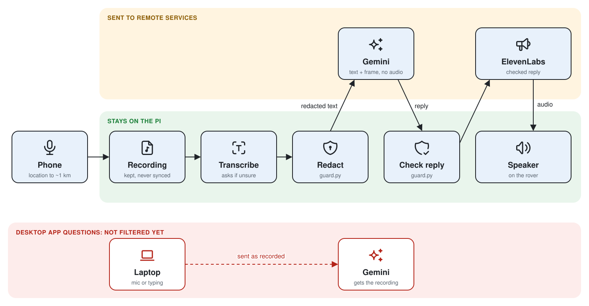
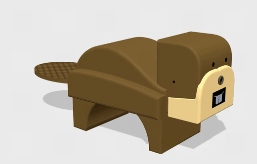
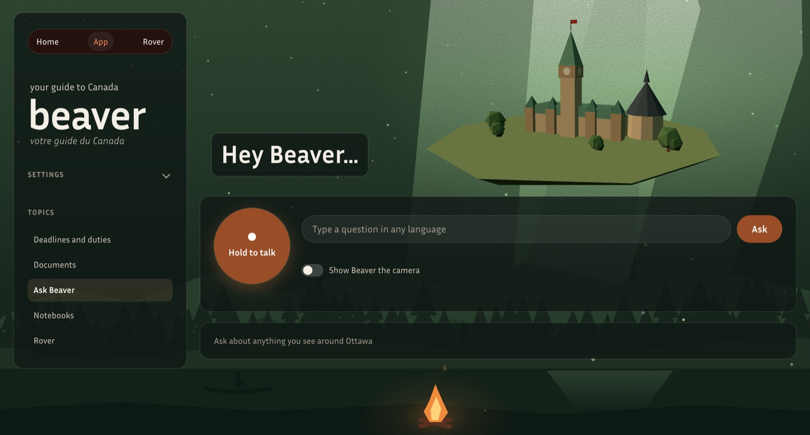
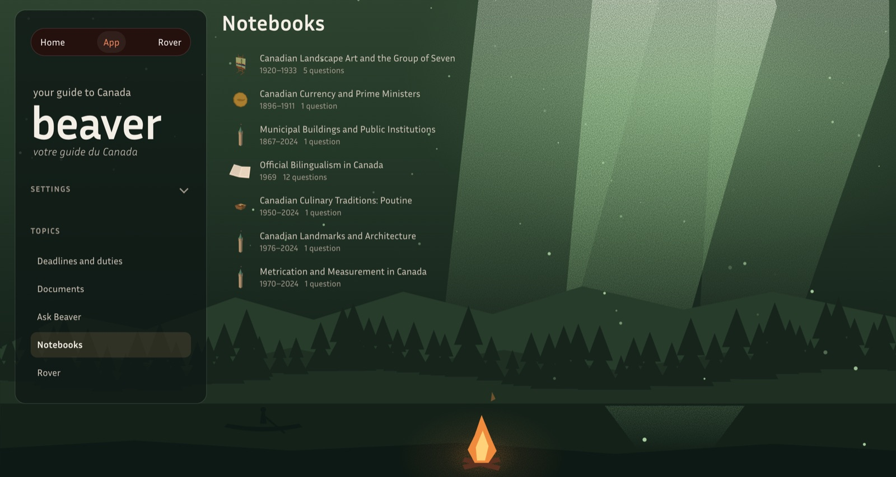
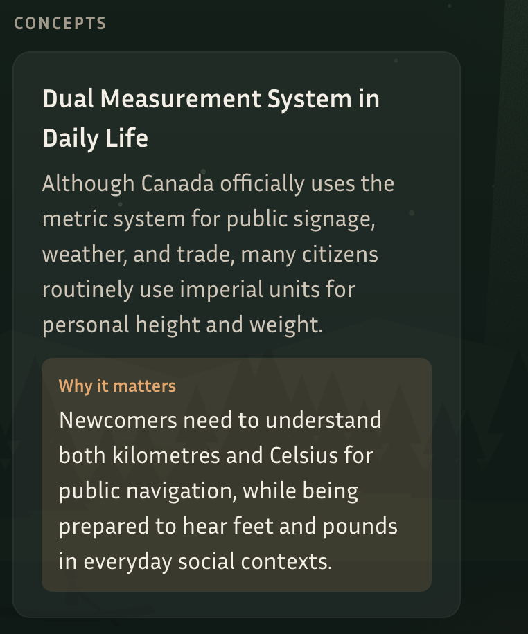
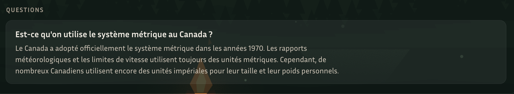

# Beaver

Beaver is the newcomer's field guide to Canada ("votre guide du Canada"): a person newly arrived
from abroad asks it how things work here and hears the answer in English, French, and their own
language. The guide has three parts:

| Part | What it covers | Status |
|---|---|---|
| Cultural fluency | Answers about Canada's history, institutions, languages, and places, kept as notebooks of the vocabulary, concepts, and dates each question taught | Built; answers citing their sources are planned in #27 |
| Duties and deadlines | The federal, provincial, and municipal dates that apply to the person, from official pages | Planned in #30 and #32 |
| Documents | A photographed letter or form, read and summarized on the laptop | Planned in #25 |

It runs as a rover on a Raspberry Pi 5, which a visitor asks through their phone, and as a desktop
app on a laptop. It is built for one person with one rover and one laptop.

## Architecture

Beaver meets the newcomer in two places. Out in the city, the rover answers a question about what
they see, asked from their phone. At the laptop, the desktop app answers their longer
questions and keeps every exchange from either place as notebooks. A guard proxy keeps their
personal information from reaching the AI services.

### Parts and connections


The rover records a spoken question and a camera frame and plays the answer on its own speaker. A
guard proxy runs on the rover between it and every remote AI service: each request passes through
the proxy, which forwards only clean text and the photo, and each answer passes back through it
before playback.

- Gemini generates the answer from the clean text and the photo.
- ElevenLabs converts the checked answer into speech.

The desktop app pulls from the rover: every 60 seconds it connects to the rover over SSH, copies
each new turn's saved record and photo, and files the turn into a notebook. The desktop app also
takes its own questions, typed or spoken at the laptop, transcribes and guards them on the laptop the
same way, and answers them sentence by sentence in English, French, or both, plus the visitor's
language.

### Guard proxy



The guard proxy runs on the rover between its microphone input and the remote AI services. It
sends them text with personal information replaced and keeps the recording on the
rover.

1. **Recording.** The rover stores the recording in its own run folder.
2. **Transcription.** Whisper converts the recording into text on the rover. When Whisper scores
   every language on the rover's list under 0.7, the rover asks the visitor to choose a language
   and sends nothing.
3. **Cleaning.** The proxy replaces personal information with a plain phrase: email addresses,
   phone numbers, postal codes, street addresses, social insurance numbers, health card numbers,
   and payment card numbers. "My number is 613 555 0142" leaves the rover as "my number is a phone
   number".
4. **Question to Gemini.** Gemini receives the clean text, the language, and the photo.
5. **Answer check.** The proxy applies the same replacements to Gemini's answer and cuts it at a
   sentence end when it exceeds 600 characters, before ElevenLabs converts it and before the rover
   saves it.

The rover's saved record holds the clean question and the kinds of personal information the proxy
replaced.

For developers: `src/beaver/core/guard.py` holds the proxy and `src/beaver/core/transcribe.py` the
transcription, both shared by the rover and the desktop app, and [`docs/architecture.md`](docs/architecture.md) describes the network
path and the files each part keeps.

## Beaver's face



The rover's face carries a small dot screen showing Beaver's mouth: a top lip and two buck teeth
that stay the same, and a lower lip that passes behind the teeth and drops below them as Beaver
speaks, following the loudness of each spoken answer. The camera sits in the head on two servos
that pan and tilt it. The 3D model at `web/beaver.html` shows the same mouth and moves it with
Beaver's recorded clips.

## Parts

| Part | Folder | What it does |
|---|---|---|
| Rover | `src/beaver/rover` | Records a spoken question and a camera frame, plays the answer on its own speaker, and saves each turn to a run folder. |
| Guard proxy | `src/beaver/rover` | A local checkpoint between the rover and the remote AI services. Whisper transcribes the recording on the rover, and the proxy replaces personal information before any text leaves the rover and checks each answer before playback. |
| Desktop app | `src/beaver/desktop` | A local web page at `http://127.0.0.1:8765/app/`, beside the home page at `/`. It starts the rover's phone page and shows its QR code, takes questions by voice or typing, replies sentence by sentence in each chosen language, and files every exchange into notebooks. Every 60 seconds it pulls the rover's new turns and files them too. |
| Home page | `web` | A static page for a laptop at a table: a spoken walk through the concept sheet, the "Hey Beaver..." exchanges, and the desktop app's screens. |
| Shared core | `src/beaver/core` | Config loading, run records, the Gemini and ElevenLabs calls, and the prompts both apps use. |

## Desktop app

Ask Beaver takes a question by holding the talk button or by typing in any language, with the
option to show Beaver the camera.



Notebooks gathers every exchange by topic, each with the years it covers and the number of
questions asked.



Inside a notebook, each concept carries a short explanation and why it matters to a newcomer, and
each question keeps its answer in the language it was asked.





## Setup

Beaver uses [uv](https://docs.astral.sh/uv/) for Python 3.13 and its dependencies.

```
uv sync --group desktop
uv run pre-commit install
```

`uv sync` builds the environment from `uv.lock` and installs the `beaver` package, so both apps can
import `beaver.core`. The API keys go in a `.env` file at the repo root, which git ignores:

```
GEMINI_API_KEY=...
ELEVENLABS_API_KEY=...
```

## Running

| Part | Command | Guide |
|---|---|---|
| Desktop app and demo | `uv run --group desktop python src/beaver/desktop/run.py serve`, then open `http://127.0.0.1:8765` | [`src/beaver/desktop/README.md`](src/beaver/desktop/README.md) |
| Rover, on the Pi | `uv run --group rover python src/beaver/rover/run.py phone` | [`src/beaver/rover/README.md`](src/beaver/rover/README.md) |
| Home page | Served by the desktop app at `http://127.0.0.1:8765` | [`web/README.md`](web/README.md) |

The rover's hardware, power, and network access are in [`docs/hardware.md`](docs/hardware.md).

## Tests

```
node --test src/beaver/desktop/tests/artifacts.test.mjs
uv run python -m unittest discover -s src/beaver/rover/tests
uv run python -m unittest discover -s src/beaver/desktop/tests
```

The first checks the desktop app's 3D piece registry against its spec; the second checks the
rover's guard rules, phone server, language detection, and mouth frames; the third checks the desktop app's
location lookup, whose fixed-point tests run once `run.py getplaces` has downloaded the boundary file. The pre-commit hook runs the first when the registry files change.

## Documentation

| File | Contents |
|---|---|
| [`docs/how-it-works.md`](docs/how-it-works.md) | Two diagrams: the parts and their connections, and the guard proxy between the rover and the AI services |
| [`docs/architecture.md`](docs/architecture.md) | The parts, the data each one keeps, sync, the shared core, and security |
| [`docs/hardware.md`](docs/hardware.md) | The rover: Raspberry Pi 5 on a SunFounder PiCar-X Robot HAT v4, power, and network access |
| [`docs/measurements.md`](docs/measurements.md) | Timings, token counts, costs, and model comparisons measured so far |

## Contributing

Work is tracked as GitHub issues in `reversely/beaver`. Each commit closes one issue with
`closes #N` in its message body, or carries `refs #N` while the issue's acceptance is incomplete.
