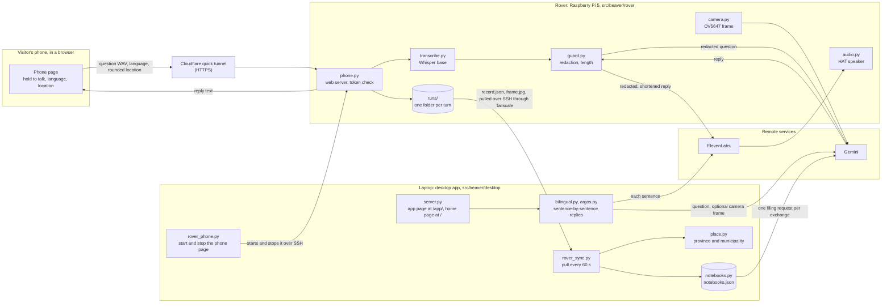
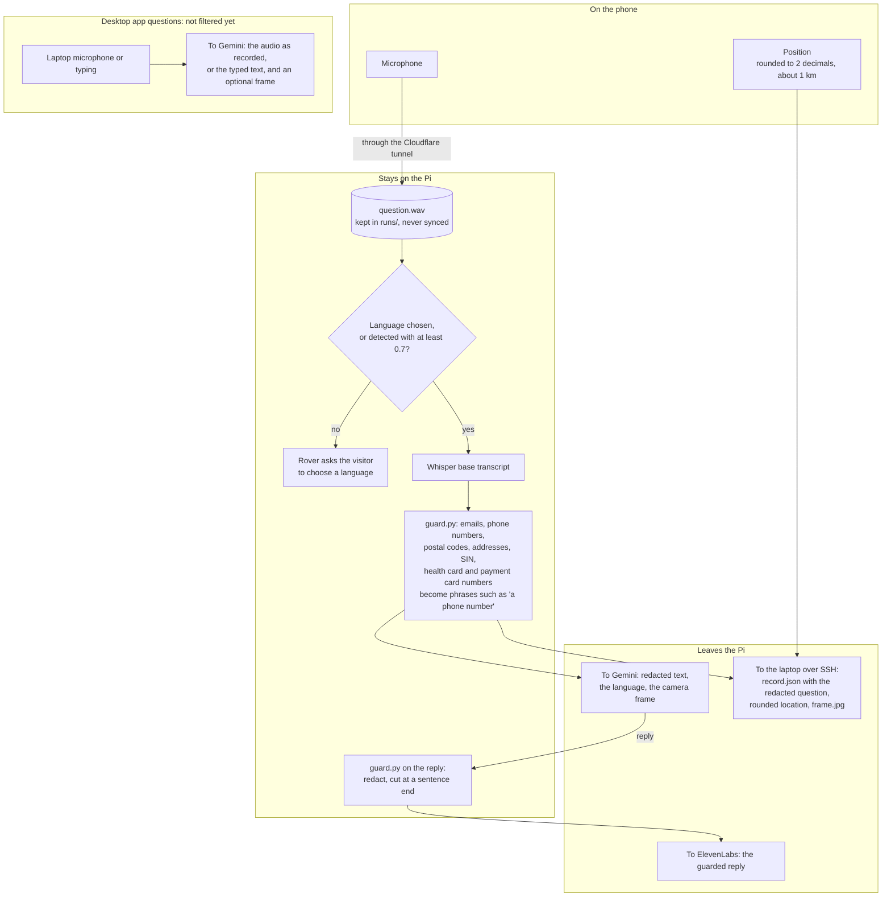

# How it works

Two diagrams: the parts of Beaver and what travels between them, and the privacy filter that
decides what Gemini receives. Both describe the code at the time of writing; the text under each
names the files involved.

## The parts

The rover answers on its own. A visitor opens the phone page from the QR code that `phone.py`
prints (the desktop app's Rover panel shows the same code through `rover_phone.py`), holds the
button, and asks. The recording reaches the Pi through a Cloudflare quick tunnel, because phone
browsers open the microphone only on HTTPS pages and the campus network blocks connections between
devices. The Pi answers through its own speaker and returns the reply text to the phone.

The laptop never receives a request from the Pi. Every 60 seconds `rover_sync.py` connects to the
Pi over SSH through Tailscale and pulls each new turn's `record.json` and `frame.jpg`, files the
turn into a notebook, and maps the turn's rounded location to a province and municipality with
`place.py` against Statistics Canada's boundary file, which is stored on the laptop.

The desktop app also takes its own questions, typed or spoken at the laptop, and answers them
sentence by sentence in English, French, or both, plus the visitor's language. Translation runs on
Gemini or on Argos models stored on the laptop.

## The privacy filter and Gemini

On the rover, the question's audio never reaches Gemini. `transcribe.py` turns it into text on the
Pi with Whisper base, either in the language the phone page sent or in the one Whisper detects.
When detection scores under 0.7 for every language on the page, the rover asks the visitor to
choose one and sends Gemini nothing. `guard.py` then replaces personal information in the
transcript with a spoken phrase, so "my number is 613 555 0142" reaches Gemini as "my number is a
phone number". Gemini writes the answer from that text and a camera frame. The same guard runs on
the reply before ElevenLabs speaks it or the run folder saves it, and cuts it at a sentence end
when it is over the speech limit. The run record keeps the redacted question and the names of the
rules that fired, never the original text.

What the filter does not cover:

- The camera frame goes to Gemini as the camera took it; nothing on the Pi checks it for faces,
  documents, or screens.
- The question audio passes through Cloudflare's network on its way to the Pi, because the quick
  tunnel's HTTPS connection ends at Cloudflare's edge.
- Questions asked in the desktop app, typed or spoken at the laptop, go to Gemini as they are: a
  spoken question is sent as audio. The guard and on-board transcription run on rover turns only.

The phone rounds its position to 2 decimal places before sending it, and the Pi rounds it again,
so a modified page cannot store a finer point. Only the rounded pair reaches the laptop, where the
province and municipality lookup runs without any remote service.
