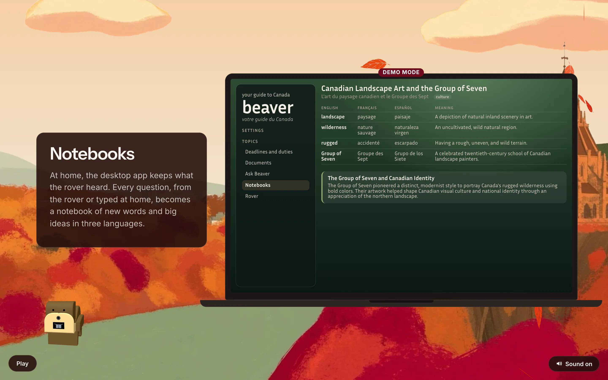
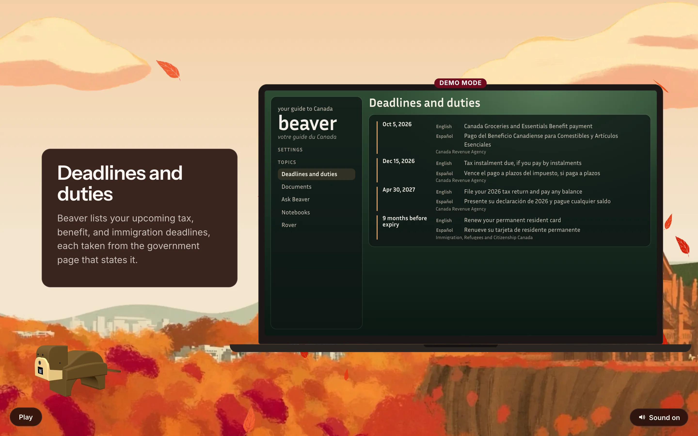
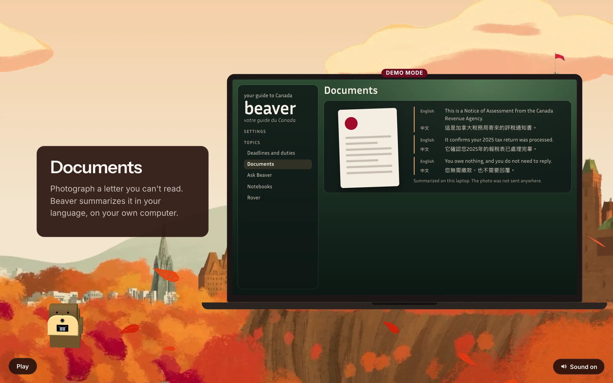
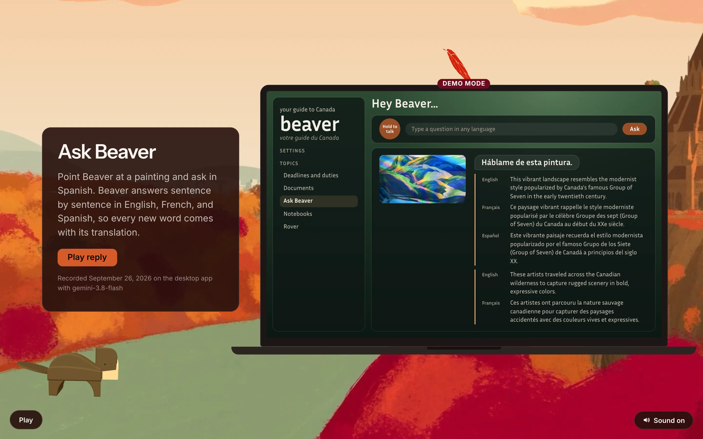
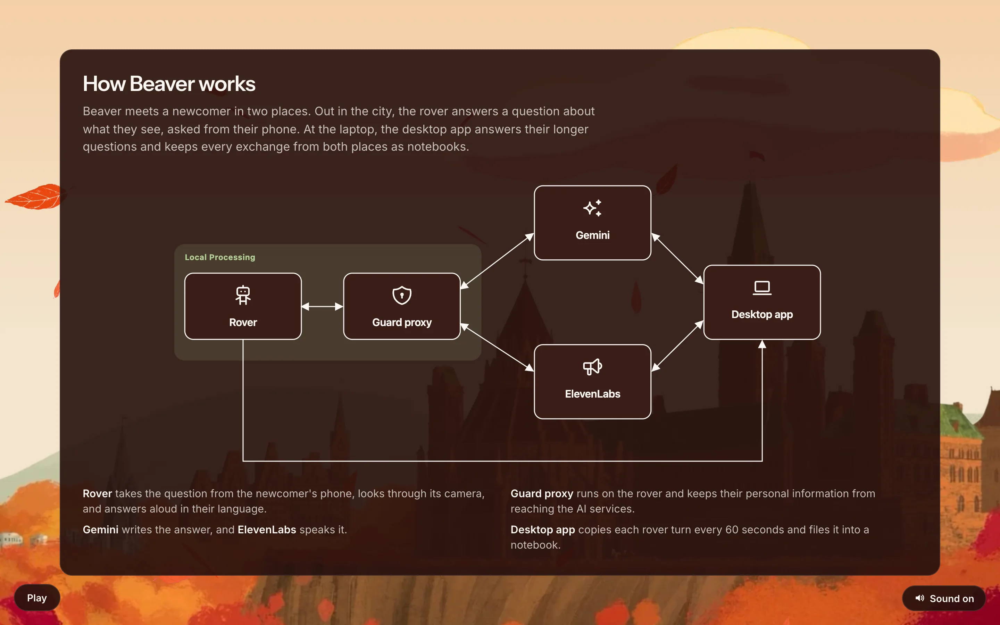
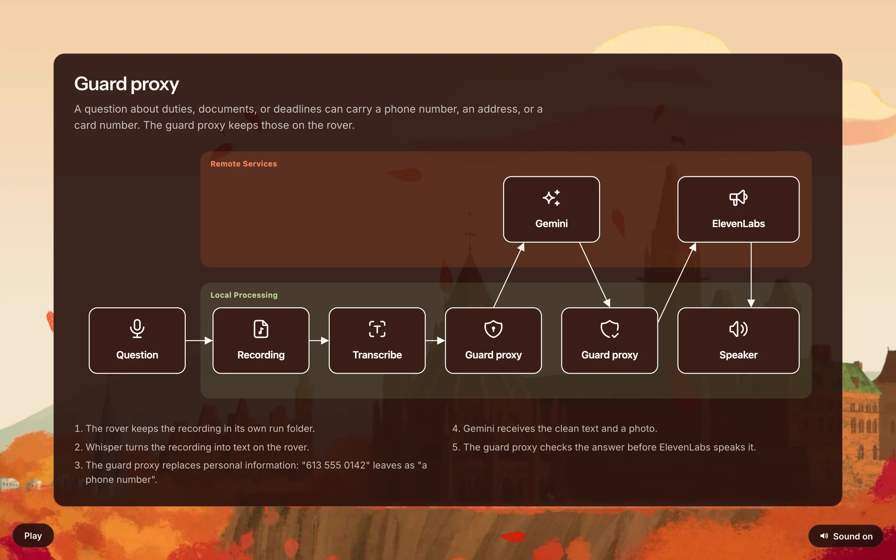
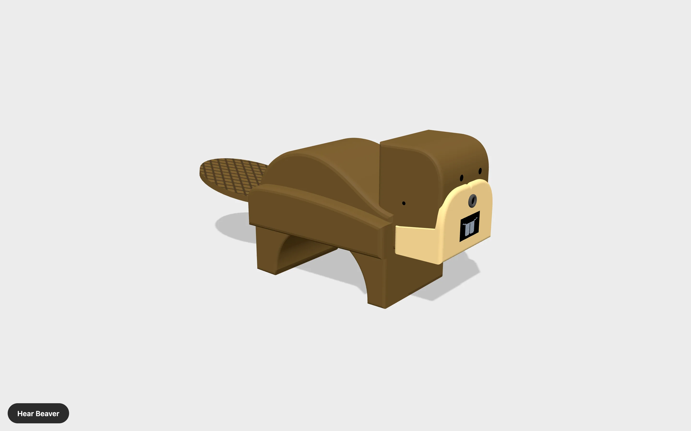

# Site screenshots

Every screen of the public site, https://beaver.select, captured on 2026-09-27 from the deployed
build of commit f087c36 in a 1440 by 900 window at twice the pixel density. Beaver sways, so his
pose differs between screens.

## Home: the greeting, which cycles through eight languages

## Story page 1, first line

## Story page 1, second line, with the English and French hello buttons

## Story page 1, third line, with arts, history, and cultural references

## Story page 1, last line

## Story page 2, first line

## Story page 2, second line

## Story page 2, last line, with the three-language diagram

## Rover: taking Beaver out, on the phone page

## Rover: around the city

## Rover: procedures, step by step

## Desktop app: notebooks

## Desktop app: deadlines and duties

## Desktop app: documents

## Desktop app: Ask Beaver

## Closing page

## How Beaver works: the parts

## How Beaver works: the guard proxy

## The Beaver model on its own page, /beaver

